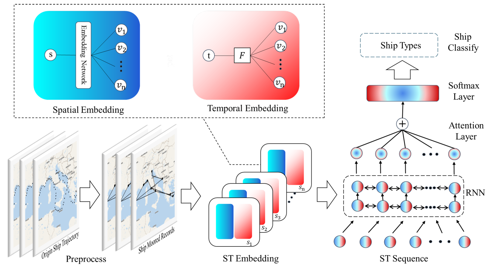

# A Hierarchical Spatial-Temporal Embedding Method Based on Enhanced Trajectory Features for Ship Type Classification

Dataset and source code of "[A Hierarchical Spatial-Temporal Embedding Method Based on Enhanced Trajectory Features for Ship Type Classification](https://www.mdpi.com/1424-8220/22/3/711)". (Sensors 2022, 22(3), 711).

## Architecture of Hi-STEM
Hi-STEM maps moored records in the original geographical space into the feature space and can efficiently find the classification plane in the feature space.


## Results
The moored records of four ships in a month are selected randomly from each type of ship for visualization. Each column in the map represents the moored records of ships of the same kind, and the colors of their moored records are also the same on the map. We can find that the same kind of ship’s moored records has no apparent similarity in both the geographical spatial distribution and the motion pattern. (a) Cargo; (b) Fishing; (c) Oil; (d) Passenger.


## Reqriments
- python 3.6
- tensorflow 1.5.0

## Usage
- python main.py

## Others

If you found this library useful in your research, please consider citing:

```
@Article{s22030711,
AUTHOR = {Sun, Tao and Xu, Yongjun and Zhang, Zhao and Wu, Lin and Wang, Fei},
TITLE = {A Hierarchical Spatial-Temporal Embedding Method Based on Enhanced Trajectory Features for Ship Type Classification},
JOURNAL = {Sensors},
VOLUME = {22},
YEAR = {2022},
NUMBER = {3},
ARTICLE-NUMBER = {711},
URL = {https://www.mdpi.com/1424-8220/22/3/711},
PubMedID = {35161462},
ISSN = {1424-8220},
DOI = {10.3390/s22030711}
}
```
